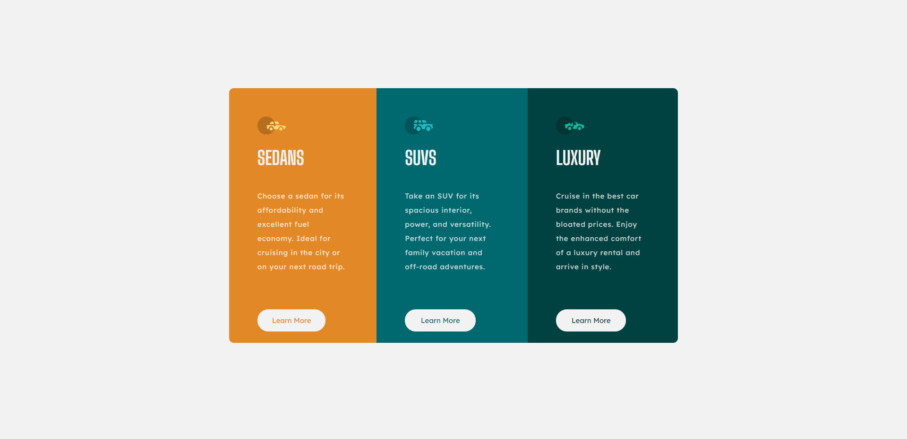

# Frontend Mentor - 3-column preview card component solution

This is a solution to the [3-column preview card component challenge on Frontend Mentor](https://www.frontendmentor.io/challenges/3column-preview-card-component-pH92eAR2-). Frontend Mentor challenges help you improve your coding skills by building realistic projects. 

## Table of contents

- [Overview](#overview)
  - [The challenge](#the-challenge)
  - [Screenshot](#screenshot)
  - [Links](#links)
- [My process](#my-process)
  - [Built with](#built-with)
  - [What I learned](#what-i-learned)
  - [Continued development](#continued-development)
- [Author](#author)

## Overview

### The challenge

Users should be able to:

- View the optimal layout depending on their device's screen size
- See hover states for interactive elements

### Screenshot

### Links

- Solution URL: https://www.frontendmentor.io/solutions/3column-preview-card-component-using-flexbox-ywvRf9ZN-
- Live Site URL: https://viktoria-zsolnai.github.io/3-column-preview-card-component/

## My process

### Built with

- HTML5 
- CSS
- Flexbox

### What I learned

 - I finally understand how flexbox works
 - I was able to write cleaner code
 - Started using variables in CSS

### Continued development

- I want to learn how to make the responsive desktop-mobile transition smoother

## Author

- Website - [viktoria.zsolnai](https://github.com/viktoria-zsolnai)
- Frontend Mentor - [@viktoria-zsolnai](https://www.frontendmentor.io/profile/viktoria-zsolnai)

